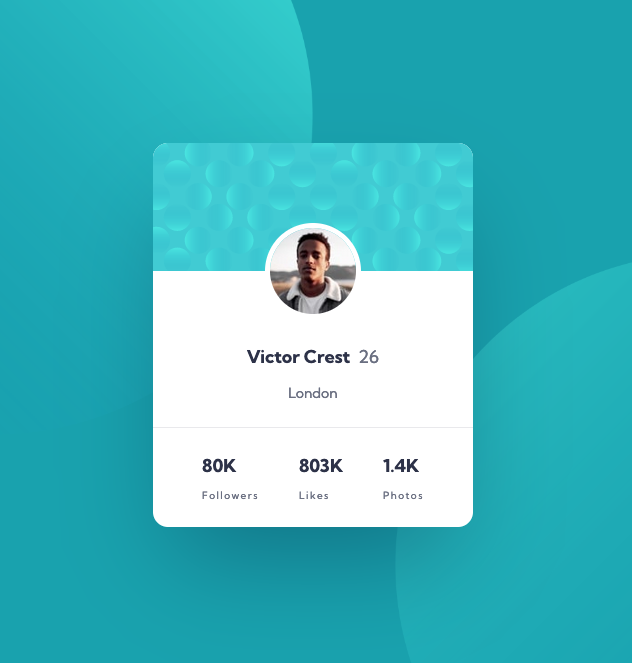

# Profile card component solution

This is a solution to the [Profile card component challenge on Frontend Mentor](https://www.frontendmentor.io/challenges/profile-card-component-cfArpWshJ). Frontend Mentor challenges help you improve your coding skills by building realistic projects.

## Table of contents

- [Profile card component solution](#profile-card-component-solution)
  - [Table of contents](#table-of-contents)
  - [Overview](#overview)
    - [The challenge](#the-challenge)
    - [Screenshots](#screenshots)
    - [Links](#links)
  - [My process](#my-process)
    - [Built with](#built-with)
    - [What I learned](#what-i-learned)
  - [Author](#author)

## Overview

### The challenge

Users should be able to:

- Build out the project to the designs provided

### Screenshots



### Links

- Solution URL: [https://github.com/tatasadi/profile-card-component](https://github.com/tatasadi/profile-card-component)
- Live Site URL: [https://profile-card-component-ta.vercel.app](https://profile-card-component-ta.vercel.app)

## My process

### Built with

- Semantic HTML5 markup
- Flexbox
- Mobile-first workflow
- [React](https://reactjs.org/) - JS library
- [Remix](https://remix.run/) - React framework
- [Tailwindcss](https://tailwindcss.com) - For styles

### What I learned

Applying multiple background in tailwind like this and make them responsive:

```css
bg-[url('/images/bg-pattern-top.svg'),_url('/images/bg-pattern-bottom.svg')]
bg-contain
bg-[position:_right_53vw_bottom_75vh,_left_51vw_top_50vh]
bg-no-repeat
lg:bg-[position:_right_49vw_bottom_70vh,_left_51vw_top_50vh]
```

## Author

- Website - [Ehsan Tatasadi](https://ehsan.tatasadi.com)
- Frontend Mentor - [@tatasadi](https://www.frontendmentor.io/profile/tatasadi)
- GitHub - [@tatasadi](https://github.com/tatasadi)
- Linkedin - [Ehsan Tatasadi](https://www.linkedin.com/in/ehsan-tatasadi-2161a433)
- Twitter - [@etatasadi](https://twitter.com/etatasadi)
